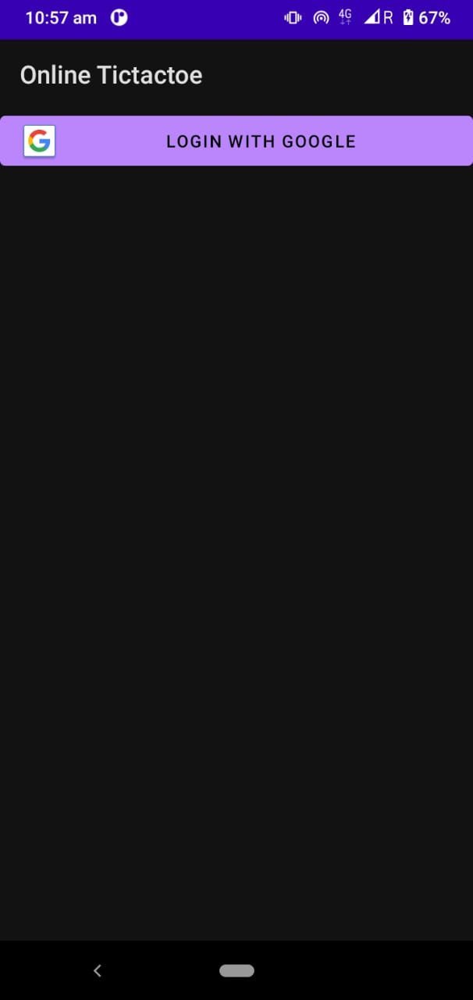

# Online TicTacToe

A simple platform to connect with your friends over internet and play tictactoe online 
## Create a room with roomname and roomkey
## Send those to your friend
## ask him/her to enter those to join
## play

# Some snapshots
|| |

  
  
    

<a id="raw-url" href="https://raw.githubusercontent.com/skrb7f16/Online-Multiplayer-Tictactoe-Kotlin/master/app\build\outputs\apk\debug\app-debug.apk">Download apk</a>
